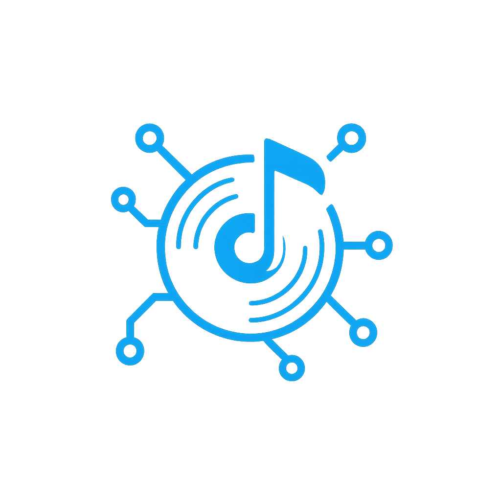

# 🎵 PAGS Music Platform



**The Future of Music Ownership & Earnings**

[](https://www.typescriptlang.org/)
[](https://reactjs.org/)
[](https://vitejs.dev/)
[](https://tailwindcss.com/)
[](https://ethereum.org/)

> **"Own the Music, Earn the Royalties"** - The first platform where fans become stakeholders in the music they love.

## ✨ What is PAGS?

PAGS is a revolutionary **Web3 music NFT marketplace** that transforms how fans interact with music. Instead of just streaming, users can **own music NFTs** and **earn royalties** from their favorite tracks. Built with Spotify-level polish and Web3 power, PAGS creates a new economy where music fans become music investors.

### 🎯 Core Concept
- **Buy Music NFTs**: Own percentages of your favorite songs
- **Earn PAGS Tokens**: Get rewarded for streaming and holding NFTs  
- **Collect Royalties**: Share in the success of tracks you own
- **Tier System**: Bronze, Silver, Gold, and Platinum ownership levels

---

## 🚀 Key Features

### 🎵 **Immersive Music Experience**
- **Persistent Audio Player** - Seamless playback across all pages
- **Waveform Visualization** - Interactive WaveSurfer.js integration
- **3D NFT Cards** - Flip animations showing track stats and earnings
- **Real-time Streaming** - High-quality audio with visual feedback

### 💎 **Advanced NFT System**
- **4-Tier Ownership** - Bronze (1k supply) → Silver (500) → Gold (100) → Platinum (10)
- **Dynamic Pricing** - Supply-based pricing with earnings projections
- **Comprehensive Analytics** - Market data, risk analysis, ROI calculations
- **Exclusive Benefits** - Tier-based perks including studio access and voting rights

### 🪙 **PAGS Token Economy**
- **Staking & Rewards** - Lock tokens for higher APY returns
- **Royalty Distribution** - Automatic earnings from NFT performance
- **DEX Integration** - Built-in token swapping functionality
- **Governance** - Vote on platform decisions and artist partnerships

### 👤 **Social & Community**
- **Artist Dashboards** - Complete analytics and upload management
- **User Profiles** - Showcase collections and earnings
- **Social Feed** - Activity streams and community interactions
- **Follow System** - Connect with artists and fellow collectors

### 🛠 **Premium UX/UI**
- **Dark/Light Themes** - Beautiful shadcn/ui components
- **Mobile-First Design** - Responsive across all devices
- **Framer Motion** - Smooth animations and transitions
- **Professional Polish** - Spotify-meets-OpenSea aesthetic

---

## 🏗 Technical Architecture

### **Frontend Stack**
```typescript
// Core Framework
React 18 + TypeScript + Vite

// Routing & State
TanStack Router (file-based)
TanStack Query (server state)

// Web3 Integration  
Wagmi + Viem (Ethereum)
ConnectKit (wallet connection)

// UI & Styling
shadcn/ui components
Tailwind CSS + CSS Variables
Framer Motion animations
Radix UI primitives

// Music & Media
WaveSurfer.js (waveforms)
Howler.js (audio playback)
```

### **Smart Contract Integration**
```typescript
// Music NFT Contract
- Multi-tier minting (Bronze/Silver/Gold/Platinum)
- Royalty distribution system
- Metadata on IPFS
- Dynamic pricing mechanism

// PAGS Token Contract  
- ERC-20 with staking functionality
- Governance voting system
- Royalty claim mechanisms
- DEX liquidity pools
```

---

## 📱 Application Structure

```
src/
├── components/
│   ├── music/           # Audio player, waveforms, visualizers
│   ├── nft/             # NFT cards, purchase modals, analytics
│   ├── token/           # PAGS staking, swapping, dashboards
│   ├── social/          # Follow buttons, activity feeds
│   └── ui/              # shadcn/ui components
│
├── routes/              # File-based routing
│   ├── marketplace/     # NFT browsing and purchasing
│   ├── portfolio/       # User collections and earnings
│   ├── artist/          # Upload and dashboard features
│   └── pags/            # Token staking and governance
│
├── hooks/
│   ├── contracts/       # Smart contract interactions
│   ├── useAudioPlayer   # Global music playback state
│   └── useWeb3Status    # Wallet and Web3 utilities
│
└── types/              # TypeScript definitions
    ├── music-nft.ts    # NFT metadata and market data
    └── token.ts        # PAGS token interfaces
```

---

## 🛠 Installation & Setup

### Prerequisites
- **Node.js** v20+ from [nodejs.org](https://nodejs.org/)
- **pnpm** from [pnpm.io](https://pnpm.io/) *(required - uses workspace features)*

### Quick Start

1. **Clone the repository**
   ```bash
   git clone <repository-url>
   cd web3-music-marketplace
   ```

2. **Install dependencies**
   ```bash
   pnpm install
   ```

3. **Environment Setup**
   ```bash
   cp .env.example .env.local
   # Add your environment variables:
   # - Wallet Connect Project ID
   # - Alchemy API keys  
   # - Contract addresses
   ```

4. **Start development server**
   ```bash
   pnpm dev
   ```

5. **Deploy smart contracts** (optional)
   ```bash
   cd hardhat
   pnpm install
   pnpm hardhat compile
   pnpm hardhat deploy --network localhost
   ```

### Environment Variables
```env
VITE_WALLET_CONNECT_PROJECT_ID=your_project_id
VITE_ALCHEMY_API_KEY=your_alchemy_key
VITE_MUSIC_NFT_ADDRESS=0x...
VITE_PAGS_TOKEN_ADDRESS=0x...
VITE_SUBGRAPH_URL=https://api.thegraph.com/subgraphs/...
```

---

## 📄 Pages & Features

| Page | Route | Features |
|------|-------|----------|
| **Landing** | `/` | Hero section, stats, feature showcase |
| **Marketplace** | `/marketplace` | NFT grid, filters, search, audio preview |
| **NFT Details** | `/marketplace/:id` | Full track info, comments, purchase |
| **Advanced Purchase** | `/marketplace/purchase/:id` | Analytics, risk assessment, projections |
| **Portfolio** | `/portfolio` | Owned NFTs, earnings, performance |
| **PAGS Dashboard** | `/pags` | Staking, governance, token analytics |
| **Artist Dashboard** | `/artist/dashboard` | Upload tracks, view analytics, manage |
| **User Profiles** | `/profile/:address` | Collections, activity, social features |

---

## 🎨 Design Philosophy

### **"Dark, Immersive, Premium"**
Combining Spotify's elegance with OpenSea's Web3 power and SoundCloud's social DNA.

**Core Principles:**
- **Music-First**: Audio experience drives every interaction
- **Investment-Grade**: Transparent analytics and risk assessment  
- **Community-Driven**: Social features that build engagement
- **Accessible**: Works beautifully on mobile and desktop

### **Theme System**
```css
/* Dark Theme (Primary) */
--background: 222.2 84% 4.9%
--primary: 262.1 83.3% 57.8%
--accent: 315 100% 60%

/* Light Theme (Secondary) */  
--background: 0 0% 100%
--primary: 222.2 47.4% 11.2%
--accent: 315 100% 60%
```

---

## 🚀 Deployment

### Development
```bash
pnpm dev          # Start development server
pnpm build        # Build for production  
pnpm preview      # Preview production build
pnpm lint         # Run ESLint checks
```

### Smart Contracts
```bash
cd hardhat
pnpm hardhat compile      # Compile contracts
pnpm hardhat test         # Run contract tests
pnpm hardhat deploy       # Deploy to network
```

### Production
- **Frontend**: Deploy to Vercel/Netlify
- **Contracts**: Deploy to Ethereum mainnet/L2
- **IPFS**: Pin metadata and audio files
- **Subgraph**: Deploy indexing for events

---

## 🤝 Contributing

We welcome contributions! Please see our [Contributing Guide](CONTRIBUTING.md) for details.

### Development Guidelines
- Use TypeScript for all new code
- Follow the existing component patterns
- Add tests for new features
- Ensure mobile responsiveness
- Maintain accessibility standards

---

## 📊 Current Status

### ✅ **Completed Features**
- [x] Complete UI/UX with dark/light themes
- [x] Music player with persistent playback
- [x] NFT marketplace with advanced search/filtering
- [x] 4-tier NFT system with purchase flows
- [x] PAGS token staking and governance
- [x] Artist upload and dashboard system
- [x] Social features and user profiles
- [x] Advanced purchase page with analytics
- [x] Mobile-responsive design

### 🔄 **In Development**
- [ ] Smart contract deployment to mainnet
- [ ] IPFS integration for metadata/audio
- [ ] Real-time price feeds
- [ ] Advanced charts and visualizations
- [ ] Mobile app (React Native)

---

## 📜 License

This project is licensed under the MIT License - see the [LICENSE](LICENSE) file for details.

---

## 🔗 Links

- **Documentation**: [Coming Soon]
- **Discord Community**: [Coming Soon] 
- **Twitter**: [Coming Soon]
- **Medium Blog**: [Coming Soon]

---

<div align="center">
  <strong>Built with ❤️ for the future of music ownership</strong>
  <br>
  <sub>Transforming fans into stakeholders, one track at a time.</sub>
</div>